<div align="center">

# 🌐 Hub and Spoke DNS Operator

**Automatically manage DNS records across Azure, GCP, and AWS from your Kubernetes Ingress resources.**

[](https://github.com/marcus1aleksand/hub-and-spoke-dns-operator/releases)
[](https://github.com/marcus1aleksand/hub-and-spoke-dns-operator/releases)
[](LICENSE)
[](https://kubernetes.io)
[](https://python.org)

[](https://github.com/marcus1aleksand/hub-and-spoke-dns-operator/actions/workflows/build_test.yml)
[](https://github.com/marcus1aleksand/hub-and-spoke-dns-operator/actions/workflows/linting_scanning.yml)
[](https://github.com/marcus1aleksand/hub-and-spoke-dns-operator/actions/workflows/unit_tests.yml)

---

*A Kubernetes operator that watches Ingress events and automatically creates, updates, and deletes DNS A records in your cloud provider's DNS service — purpose-built for hub-and-spoke network architectures.*

</div>

## 🏗️ Architecture

The operator is designed for hub-and-spoke network topologies where Kubernetes clusters run in spoke networks behind a central hub firewall with NAT rules.

```mermaid
graph TB
    subgraph Internet
        USER[("🌍 Users")]
    end

    subgraph Hub["🔒 Hub Network"]
        FW["🛡️ Firewall / NAT Gateway<br/>Public IP: 203.0.113.1"]
    end

    subgraph Spoke1["📡 Spoke Network 1"]
        K8S1["☸️ Kubernetes Cluster"]
        ING1["Ingress: app1.example.com"]
    end

    subgraph Spoke2["📡 Spoke Network 2"]
        K8S2["☸️ Kubernetes Cluster"]
        ING2["Ingress: app2.example.com"]
    end

    subgraph DNS["☁️ Cloud DNS"]
        AZURE["Azure DNS Zone"]
        GCP["Google Cloud DNS"]
        AWS["AWS Route53"]
    end

    subgraph Operator["⚙️ DNS Operator"]
        OP["hub-and-spoke-dns-operator<br/>Watches Ingress Events"]
    end

    USER --> FW
    FW --> K8S1
    FW --> K8S2
    K8S1 --> ING1
    K8S2 --> ING2

    OP -.->|"watches"| ING1
    OP -.->|"watches"| ING2
    OP ==>|"creates/updates/deletes<br/>A records"| AZURE
    OP ==>|"creates/updates/deletes<br/>A records"| GCP
    OP ==>|"creates/updates/deletes<br/>A records"| AWS

    style Hub fill:#e8f4f8,stroke:#2196F3,stroke-width:2px
    style Spoke1 fill:#fff3e0,stroke:#FF9800,stroke-width:2px
    style Spoke2 fill:#fff3e0,stroke:#FF9800,stroke-width:2px
    style DNS fill:#e8f5e9,stroke:#4CAF50,stroke-width:2px
    style Operator fill:#fce4ec,stroke:#E91E63,stroke-width:2px
    style Internet fill:#f3e5f5,stroke:#9C27B0,stroke-width:2px
```



### How It Works

1. **Watch** — The operator watches all Ingress resources in the cluster via Kubernetes API
2. **Detect** — When an Ingress is created, modified, or deleted, the operator captures the event
3. **Resolve IP** — Uses either the Ingress load balancer IP or a configured `customIP` (e.g., firewall public IP)
4. **Sync DNS** — Creates, updates, or deletes the corresponding A record in your cloud DNS provider
5. **Observe** — Exposes Prometheus metrics for monitoring operations, latency, and errors

## ✨ Features

| Feature | Description |
|---------|-------------|
| **☁️ Multi-Cloud** | Azure DNS, Google Cloud DNS, and AWS Route53 support |
| **⚡ Event-Driven** | Real-time DNS updates via Kubernetes event watching |
| **🔄 Custom IP Override** | Use a custom IP (e.g., firewall NAT IP) instead of ingress IP |
| **📊 Prometheus Metrics** | Built-in metrics for operations, latency, and error tracking |
| **🏥 Health Checks** | Liveness and readiness probes for reliable operations |
| **🔐 Secure by Default** | Managed identity / IAM role support, no hardcoded credentials |
| **📦 Helm Chart** | Production-ready Helm chart with full configurability |
| **⏱️ Configurable TTL** | Set custom TTL for DNS records |

## 🚀 Quick Start

### Prerequisites

- Kubernetes 1.28+
- Helm 3.x
- Cloud provider credentials configured (see provider-specific setup below)

### Installation

```bash
helm install dns-operator oci://ghcr.io/marcus1aleksand/helm-charts/hub-and-spoke-dns-operator
```

## ☁️ Cloud Provider Setup

### Azure DNS

<details open>
<summary><strong>Azure DNS Zone Configuration</strong></summary>

**Prerequisites:**
- Azure DNS Zone created
- Managed Identity with `DNS Zone Contributor` role on the DNS Zone

```bash
helm install dns-operator oci://ghcr.io/marcus1aleksand/helm-charts/hub-and-spoke-dns-operator \
  --set cloudProvider=azure \
  --set azure.subscriptionId="your-subscription-id" \
  --set azure.dnsZone="example.com" \
  --set azure.dnsResourceGroup="rg-dns" \
  --set azure.managedIdentityClientId="your-mi-client-id" \
  --set customIP="203.0.113.1"
```

**Authentication:** Uses Azure Managed Identity (Workload Identity). Assign the `DNS Zone Contributor` role:

```bash
az role assignment create \
  --assignee <managed-identity-client-id> \
  --role "DNS Zone Contributor" \
  --scope /subscriptions/<sub-id>/resourceGroups/<rg>/providers/Microsoft.Network/dnszones/<zone>
```

</details>

### Google Cloud DNS

<details>
<summary><strong>Google Cloud DNS Configuration</strong></summary>

**Prerequisites:**
- Cloud DNS managed zone created
- GCP Service Account with `dns.admin` role

```bash
helm install dns-operator oci://ghcr.io/marcus1aleksand/helm-charts/hub-and-spoke-dns-operator \
  --set cloudProvider=gcp \
  --set gcp.projectId="my-gcp-project" \
  --set gcp.managedZone="my-dns-zone" \
  --set gcp.dnsZone="example.com" \
  --set gcp.serviceAccountKey="gcp-dns-sa-key" \
  --set customIP="203.0.113.1"
```

**Authentication:** Create a service account and store the key as a Kubernetes secret:

```bash
# Create GCP service account
gcloud iam service-accounts create dns-operator \
  --display-name="DNS Operator Service Account"

# Grant DNS admin role
gcloud projects add-iam-policy-binding my-gcp-project \
  --member="serviceAccount:dns-operator@my-gcp-project.iam.gserviceaccount.com" \
  --role="roles/dns.admin"

# Create key and store as K8s secret
gcloud iam service-accounts keys create key.json \
  --iam-account=dns-operator@my-gcp-project.iam.gserviceaccount.com

kubectl create secret generic gcp-dns-sa-key --from-file=key.json=key.json
```

</details>

### AWS Route53

<details>
<summary><strong>AWS Route53 Configuration</strong></summary>

**Prerequisites:**
- Route53 hosted zone created
- IAM role/user with `route53:ChangeResourceRecordSets` and `route53:ListResourceRecordSets` permissions

```bash
helm install dns-operator oci://ghcr.io/marcus1aleksand/helm-charts/hub-and-spoke-dns-operator \
  --set cloudProvider=aws \
  --set aws.hostedZoneId="Z1234567890ABC" \
  --set aws.dnsZone="example.com" \
  --set aws.region="us-east-1" \
  --set customIP="203.0.113.1"
```

**Authentication:** Use IAM Roles for Service Accounts (IRSA) for production:

```bash
# Create IAM policy
cat > dns-policy.json <<EOF
{
  "Version": "2012-10-17",
  "Statement": [
    {
      "Effect": "Allow",
      "Action": [
        "route53:ChangeResourceRecordSets",
        "route53:ListResourceRecordSets"
      ],
      "Resource": "arn:aws:route53:::hostedzone/Z1234567890ABC"
    }
  ]
}
EOF

aws iam create-policy --policy-name DNSOperatorPolicy --policy-document file://dns-policy.json

# Associate with K8s service account via IRSA
eksctl create iamserviceaccount \
  --name dnsoperator \
  --namespace default \
  --cluster my-cluster \
  --attach-policy-arn arn:aws:iam::123456789012:policy/DNSOperatorPolicy \
  --approve
```

</details>

## 🔧 Configuration Reference

### Common Values

| Parameter | Description | Default |
|-----------|-------------|---------|
| `cloudProvider` | Cloud provider: `azure`, `gcp`, `aws` | `azure` |
| `customIP` | Override IP for DNS records (e.g., firewall IP) | `""` |
| `customTTL` | TTL for DNS records (seconds) | `300` |
| `replicaCount` | Number of operator replicas | `1` |
| `metrics.enabled` | Enable Prometheus metrics | `true` |
| `metrics.serviceMonitor.enabled` | Create ServiceMonitor for Prometheus Operator | `false` |

### Provider Comparison

| Feature | Azure DNS | Google Cloud DNS | AWS Route53 |
|---------|-----------|------------------|-------------|
| **Auth Method** | Managed Identity | Service Account Key / Workload Identity | IRSA / Access Keys |
| **Record Types** | A records | A records | A records |
| **Zone Type** | Public DNS Zone | Managed Zone | Hosted Zone |
| **Required Role** | DNS Zone Contributor | roles/dns.admin | route53:Change/ListResourceRecordSets |

## 📊 Metrics

The operator exposes Prometheus metrics on port `8080` at `/metrics`:

| Metric | Type | Description |
|--------|------|-------------|
| `dns_operator_operations_total` | Counter | Total DNS operations (by operation, status, provider) |
| `dns_operator_operation_duration_seconds` | Histogram | Duration of DNS operations |
| `dns_operator_errors_total` | Counter | DNS operation errors (by type) |
| `dns_operator_records_managed` | Gauge | Currently managed DNS records |
| `dns_operator_info` | Gauge | Operator metadata (zone, provider, version) |

## 🛡️ Security

- **No hardcoded credentials** — Uses managed identities, IRSA, and workload identity
- **Checkov scanning** — IaC security scanning on all PRs
- **Pre-commit hooks** — Automated validation before commits
- **Minimal RBAC** — ClusterRole limited to Ingress read access
- **Non-root container** — Runs with restricted security context

## 📁 Project Structure

```
hub-and-spoke-dns-operator/
├── operator/                    # Python operator source
│   ├── main.py                  # Main operator logic
│   ├── providers/               # Cloud DNS provider implementations
│   │   ├── base.py              # Abstract base provider
│   │   ├── azure.py             # Azure DNS provider
│   │   ├── gcp.py               # Google Cloud DNS provider
│   │   └── aws.py               # AWS Route53 provider
│   ├── test_main.py             # Unit tests
│   ├── Dockerfile               # Container image
│   └── requirements.txt         # Python dependencies
├── charts/                      # Helm chart
│   ├── Chart.yaml
│   ├── values.yaml
│   └── templates/
├── docs/                        # Documentation
│   ├── architecture.md          # Architecture deep-dive
│   ├── azure-setup.md           # Azure setup guide
│   ├── gcp-setup.md             # GCP setup guide
│   └── aws-setup.md             # AWS setup guide
└── secrets-injector/            # External secrets integration
```

## 🤝 Contributing

1. Fork the repository
2. Create a feature branch (`git checkout -b feature/amazing-feature`)
3. Install pre-commit hooks: `brew install pre-commit && pre-commit install`
4. Make your changes and run tests
5. Submit a Pull Request

## 📄 License

This project is licensed under the MIT License — see the [LICENSE](LICENSE) file for details.

## 👨‍💻 Maintainers

| Name | GitHub |
|------|--------|
| Marcus Aleks | [@marcus1aleksand](https://github.com/marcus1aleksand) |

---

<div align="center">

**⭐ If you find this project useful, please give it a star! ⭐**

</div>
