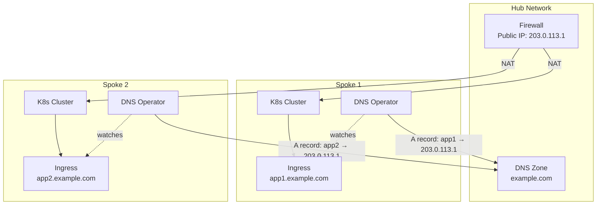
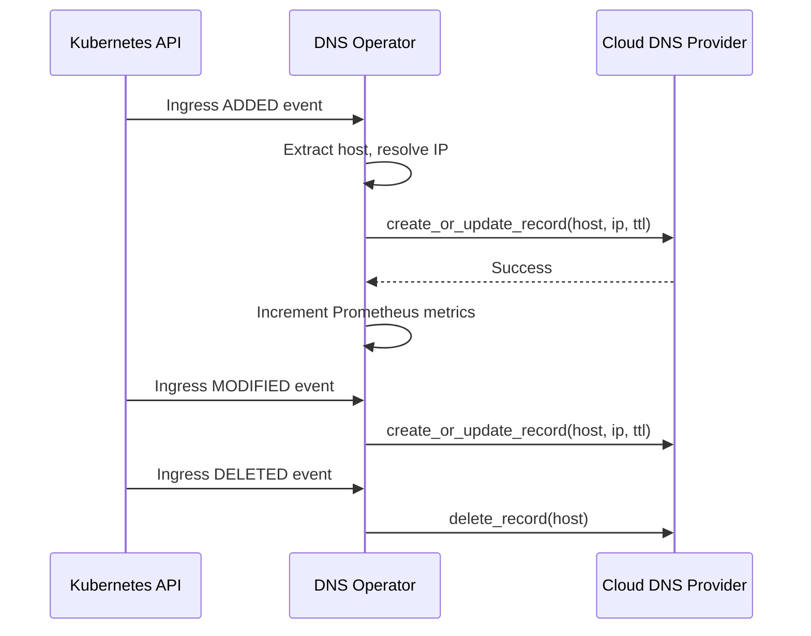

# Architecture

## Overview

The Hub and Spoke DNS Operator is a Kubernetes operator built with [kopf](https://kopf.readthedocs.io/) that automates DNS record management for Ingress resources across multi-cloud environments.

## Hub-and-Spoke Network Model

In enterprise environments, Kubernetes clusters often run in **spoke networks** connected to a central **hub network** that provides shared services like firewalls, VPN gateways, and DNS.



## Component Design

### Provider Abstraction

The operator uses a **provider pattern** to support multiple cloud DNS services through a unified interface:

```
DNSProvider (Abstract Base)
├── AzureDNSProvider  — Azure DNS Zones via azure-mgmt-dns
├── GCPDNSProvider    — Google Cloud DNS via google-cloud-dns
└── AWSDNSProvider    — AWS Route53 via boto3
```

The `CLOUD_PROVIDER` environment variable selects which provider is instantiated at startup. All providers implement the same `create_or_update_record()` and `delete_record()` interface.

### Event Flow



### Custom IP Logic

When `customIP` is set, the operator uses it instead of the Ingress's load balancer IP — **except** when the Ingress uses `nginx-internal` ingress class (indicating internal-only traffic that shouldn't get the public firewall IP).

## Observability

The operator exposes Prometheus metrics on `:8080/metrics` with dimensions for `operation`, `status`, and `provider`, enabling per-cloud-provider monitoring dashboards.
