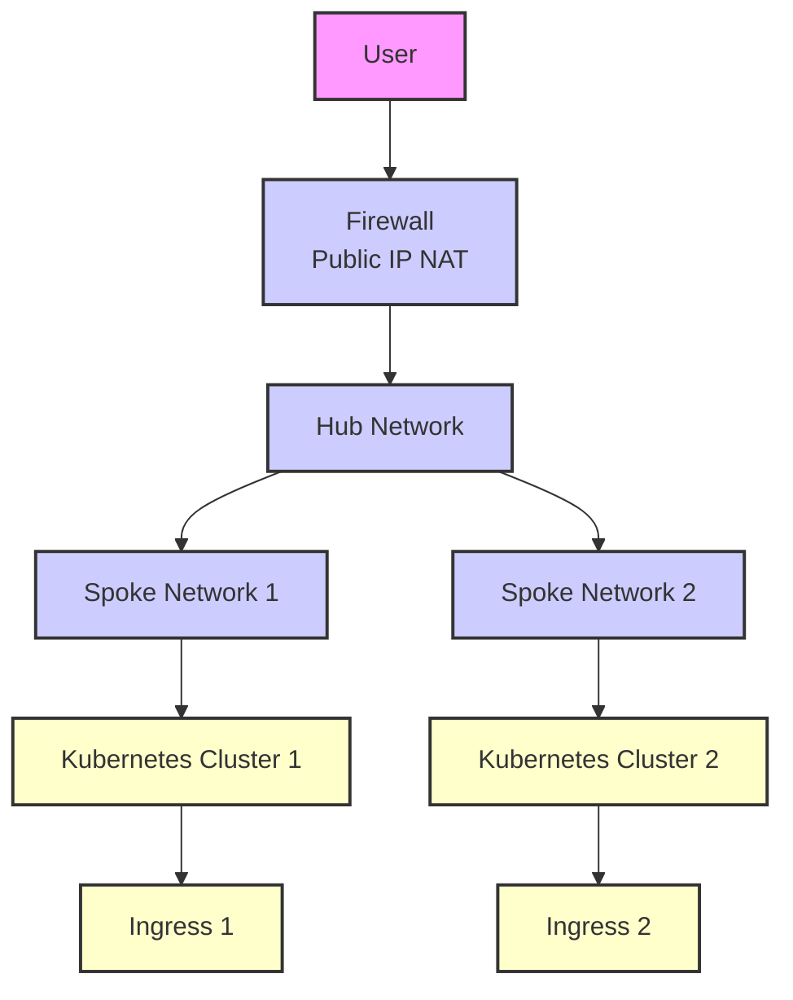

# hub-and-spoke-azure-dns-operator

  

The Azure Hub and Spoke DNS Operator is an event-based DNS record operator tool designed for a specific use case within Kubernetes environments. It manages Kubernetes influxes fronted by a firewall in a Hub Network and having NAT rules to direct traffic to Kubernetes Influxes in a Spoke Network.

This operator monitors Kubernetes events for Ingress resource creation, updates, or deletion and then creates a Type A DNS record in the target DNS zone. It can set the IP associated with the Ingress resource or a "customIP" parameter defined in the helm chart provided with this operator.



## Helm-chart Description

A Helm chart for the Hub and Spoke Azure Kubernetes DNS Operator

## Maintainers

| Name | Email | Url |
| ---- | ------ | --- |
| Marcus Aleksandravicius | <marcus1aleksand@gmail.com> | <https://github.com/marcus1aleksand> |

## Values

<table height="400px" >
	<thead>
		<th>Key</th>
		<th>Type</th>
		<th>Default</th>
		<th>Description</th>
	</thead>
	<tbody>
		<tr>
			<td id="azure--dnsResourceGroup"><a href="./values.yaml#L17">azure.dnsResourceGroup</a></td>
			<td>
string
</td>
			<td>
				<div style="max-width: 300px;">
<pre lang="json">
""
</pre>
</div>
			</td>
			<td></td>
		</tr>
		<tr>
			<td id="azure--dnsZone"><a href="./values.yaml#L16">azure.dnsZone</a></td>
			<td>
string
</td>
			<td>
				<div style="max-width: 300px;">
<pre lang="json">
""
</pre>
</div>
			</td>
			<td></td>
		</tr>
		<tr>
			<td id="azure--managedIdentityClientId"><a href="./values.yaml#L18">azure.managedIdentityClientId</a></td>
			<td>
string
</td>
			<td>
				<div style="max-width: 300px;">
<pre lang="json">
""
</pre>
</div>
			</td>
			<td></td>
		</tr>
		<tr>
			<td id="azure--subscriptionId"><a href="./values.yaml#L15">azure.subscriptionId</a></td>
			<td>
string
</td>
			<td>
				<div style="max-width: 300px;">
<pre lang="json">
""
</pre>
</div>
			</td>
			<td></td>
		</tr>
		<tr>
			<td id="customIP"><a href="./values.yaml#L11">customIP</a></td>
			<td>
string
</td>
			<td>
				<div style="max-width: 300px;">
<pre lang="json">
""
</pre>
</div>
			</td>
			<td>Paramater with the IP address to override the ingress assigned IP when creating the DNS record.</td>
		</tr>
		<tr>
			<td id="customTTL"><a href="./values.yaml#L13">customTTL</a></td>
			<td>
int
</td>
			<td>
				<div style="max-width: 300px;">
<pre lang="json">
300
</pre>
</div>
			</td>
			<td>Paramater with the TTL to be used when creating the automated DNS record.</td>
		</tr>
		<tr>
			<td id="deployment--automountServiceAccountToken"><a href="./values.yaml#L9">deployment.automountServiceAccountToken</a></td>
			<td>
bool
</td>
			<td>
				<div style="max-width: 300px;">
<pre lang="json">
false
</pre>
</div>
			</td>
			<td></td>
		</tr>
		<tr>
			<td id="fullnameOverride"><a href="./values.yaml#L6">fullnameOverride</a></td>
			<td>
string
</td>
			<td>
				<div style="max-width: 300px;">
<pre lang="json">
""
</pre>
</div>
			</td>
			<td></td>
		</tr>
		<tr>
			<td id="image--pullPolicy"><a href="./values.yaml#L3">image.pullPolicy</a></td>
			<td>
string
</td>
			<td>
				<div style="max-width: 300px;">
<pre lang="json">
"Always"
</pre>
</div>
			</td>
			<td></td>
		</tr>
		<tr>
			<td id="image--repository"><a href="./values.yaml#L2">image.repository</a></td>
			<td>
string
</td>
			<td>
				<div style="max-width: 300px;">
<pre lang="json">
"docker.cloudsmith.io/opennms/docker-private/dnsoperator"
</pre>
</div>
			</td>
			<td></td>
		</tr>
		<tr>
			<td id="imageCredentials"><a href="./values.yaml#L4">imageCredentials</a></td>
			<td>
string
</td>
			<td>
				<div style="max-width: 300px;">
<pre lang="json">
"image-credentials"
</pre>
</div>
			</td>
			<td></td>
		</tr>
		<tr>
			<td id="nameOverride"><a href="./values.yaml#L5">nameOverride</a></td>
			<td>
string
</td>
			<td>
				<div style="max-width: 300px;">
<pre lang="json">
""
</pre>
</div>
			</td>
			<td></td>
		</tr>
		<tr>
			<td id="replicaCount"><a href="./values.yaml#L7">replicaCount</a></td>
			<td>
int
</td>
			<td>
				<div style="max-width: 300px;">
<pre lang="json">
1
</pre>
</div>
			</td>
			<td></td>
		</tr>
		<tr>
			<td id="serviceAccount--create"><a href="./values.yaml#L20">serviceAccount.create</a></td>
			<td>
bool
</td>
			<td>
				<div style="max-width: 300px;">
<pre lang="json">
true
</pre>
</div>
			</td>
			<td></td>
		</tr>
		<tr>
			<td id="serviceAccount--name"><a href="./values.yaml#L21">serviceAccount.name</a></td>
			<td>
string
</td>
			<td>
				<div style="max-width: 300px;">
<pre lang="json">
"azurednsoperator"
</pre>
</div>
			</td>
			<td></td>
		</tr>
	</tbody>
</table>

## Security Checks

Security checks in this repository are performed by a pipeline that executes Checkov whenever a Pull Request is created against the main branch.

[Checkov](https://github.com/bridgecrewio/checkov?tab=readme-ov-file) is a static code analysis tool for infrastructure as code (IaC) and also a software composition analysis (SCA) tool for images and open source packages.

It scans cloud infrastructure provisioned using Terraform, Terraform plan, Cloudformation, AWS SAM, Kubernetes, Helm charts, Kustomize, Dockerfile, Serverless, Bicep, OpenAPI or ARM Templates and detects security and compliance misconfigurations using graph-based scanning.

It performs Software Composition Analysis (SCA) scanning which is a scan of open source packages and images for Common Vulnerabilities and Exposures (CVEs).

Checkov also powers Prisma Cloud Application Security, the developer-first platform that codifies and streamlines cloud security throughout the development lifecycle. Prisma Cloud identifies, fixes, and prevents misconfigurations in cloud resources and infrastructure-as-code files.

## Validation Hooks

This repository has pre-commit hooks configuration within it. This is utilized to run a set of validations locally such as automatically fixing formatting issues before the code is pushed to a remote branch.git s

In order to have the pre-commit working in your local IDE, after cloning this repository locally, run the following commands:

1. Install pre-commit locally
```
brew install pre-commit
```

2. After cloning this repository and having pre-commit installed in your locall computer, run the following command via CLI in the repository directory:
```
pre-commit install
```
Done! now whenever a commit command is executed, your code terraform code will be fully validated and documentation will be automatically updated before it is pushed to the remote repository's branch.

----------------------------------------------