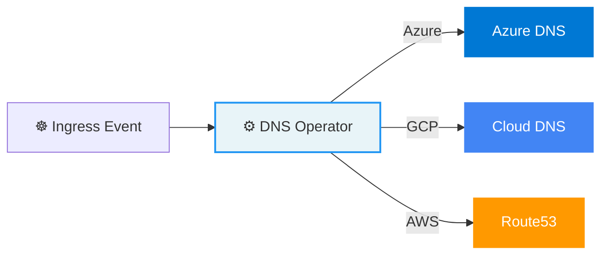

---
hide:
  - navigation
---

<style>
.md-typeset h1 {
  display: none;
}
.hero {
  text-align: center;
  padding: 2rem 0 1rem;
}
.hero h2 {
  font-size: 2.5rem;
  font-weight: 700;
  margin-bottom: 0.5rem;
}
.hero p.subtitle {
  font-size: 1.2rem;
  opacity: 0.8;
  max-width: 700px;
  margin: 0 auto 1.5rem;
}
.badges {
  margin-bottom: 2rem;
}
.badges img {
  margin: 2px;
}
.grid-cards {
  display: grid;
  grid-template-columns: repeat(auto-fit, minmax(250px, 1fr));
  gap: 1rem;
  margin: 2rem 0;
}
.grid-card {
  border: 1px solid var(--md-default-fg-color--lightest);
  border-radius: 8px;
  padding: 1.5rem;
  transition: box-shadow 0.2s;
}
.grid-card:hover {
  box-shadow: 0 4px 12px rgba(0,0,0,0.1);
}
.grid-card h3 {
  margin-top: 0;
}
</style>

<div class="hero" markdown>

# Hub and Spoke DNS Operator

## :material-dns: Hub and Spoke DNS Operator

<p class="subtitle">
A multi-cloud Kubernetes operator that automatically manages DNS records for Ingress resources — purpose-built for hub-and-spoke network architectures.
</p>

<div class="badges">

[](https://github.com/marcus1aleksand/hub-and-spoke-dns-operator/releases)
[](https://github.com/marcus1aleksand/hub-and-spoke-dns-operator/blob/main/LICENSE)
[](https://kubernetes.io)
[](https://python.org)

</div>

[Get Started :material-arrow-right:](quickstart.md){ .md-button .md-button--primary }
[View on GitHub :material-github:](https://github.com/marcus1aleksand/hub-and-spoke-dns-operator){ .md-button }

</div>

---

## :zap: Key Features

<div class="grid-cards" markdown>

<div class="grid-card" markdown>

### :cloud: Multi-Cloud Support

Manage DNS records across **Azure DNS**, **Google Cloud DNS**, and **AWS Route53** with a single operator deployment.

</div>

<div class="grid-card" markdown>

### :material-lightning-bolt: Event-Driven

Watches Kubernetes Ingress events in real-time — DNS records are created, updated, and deleted automatically.

</div>

<div class="grid-card" markdown>

### :shield: Secure by Default

Uses managed identities, IRSA, and workload identity. No hardcoded credentials. Minimal RBAC. Non-root container.

</div>

<div class="grid-card" markdown>

### :bar_chart: Observable

Built-in Prometheus metrics for operations, latency, and error tracking. ServiceMonitor support included.

</div>

<div class="grid-card" markdown>

### :package: Helm-Ready

Production-ready Helm chart with full configurability. Install in one command from GHCR.

</div>

<div class="grid-card" markdown>

### :gear: Flexible IP Override

Use a custom IP (e.g., firewall NAT IP) instead of the Ingress load balancer IP for hub-and-spoke topologies.

</div>

</div>

## :thinking: How It Works

The operator is designed for **hub-and-spoke network topologies** where Kubernetes clusters run in spoke networks behind a central hub firewall with NAT rules.



1. **Watch** — The operator watches all Ingress resources in the cluster
2. **Detect** — When an Ingress is created, modified, or deleted, the operator captures the event
3. **Resolve IP** — Uses either the Ingress load balancer IP or a configured `customIP`
4. **Sync DNS** — Creates, updates, or deletes the corresponding A record in your cloud DNS provider

## :rocket: Quick Install

```bash
helm install dns-operator \
  oci://ghcr.io/marcus1aleksand/helm-charts/hub-and-spoke-dns-operator \
  --set cloudProvider=azure \
  --set azure.subscriptionId="your-sub-id" \
  --set azure.dnsZone="example.com" \
  --set azure.dnsResourceGroup="rg-dns" \
  --set customIP="203.0.113.1"
```

[:material-arrow-right: Full installation guide](quickstart.md)

## :cloud: Supported Providers

| Provider | Service | Auth Method | Status |
|----------|---------|-------------|--------|
| **Azure** | Azure DNS Zones | Managed Identity / Workload Identity | :white_check_mark: Stable |
| **GCP** | Cloud DNS | Service Account / Workload Identity | :white_check_mark: Stable |
| **AWS** | Route53 | IRSA / IAM Roles | :white_check_mark: Stable |
