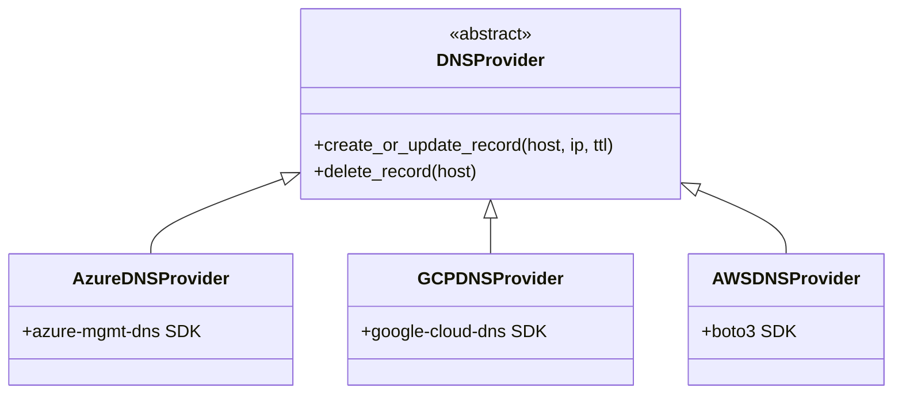

# Cloud Providers Overview

The Hub and Spoke DNS Operator uses a **provider abstraction pattern** to support multiple cloud DNS services through a unified interface.

## Provider Architecture

The `cloudProvider` Helm value (or `CLOUD_PROVIDER` environment variable) selects which provider is instantiated at startup.

## Comparison

| Feature | Azure DNS | Google Cloud DNS | AWS Route53 |
|---------|-----------|------------------|-------------|
| **Auth Method** | Managed Identity / Workload Identity | Service Account Key / Workload Identity | IRSA / Access Keys |
| **Record Types** | A records | A records | A records |
| **Zone Type** | Public DNS Zone | Managed Zone | Hosted Zone |
| **Required Role** | `DNS Zone Contributor` | `roles/dns.admin` | `route53:Change/ListResourceRecordSets` |
| **SDK** | `azure-mgmt-dns` | `google-cloud-dns` | `boto3` |

## Choosing a Provider

All three providers offer the same core functionality. Choose based on where your DNS zone is hosted:

- **Azure DNS** — Best for Azure-native environments with AKS and Managed Identity
- **Google Cloud DNS** — Best for GCP environments with GKE and Workload Identity
- **AWS Route53** — Best for AWS environments with EKS and IRSA

!!! tip "Multi-cloud DNS"
    You can run multiple instances of the operator in the same cluster, each configured with a different provider, to manage DNS records across multiple cloud providers simultaneously.

## Setup Guides

- :material-microsoft-azure: [Azure DNS Setup](azure-setup.md)
- :material-google-cloud: [Google Cloud DNS Setup](gcp-setup.md)
- :material-aws: [AWS Route53 Setup](aws-setup.md)
